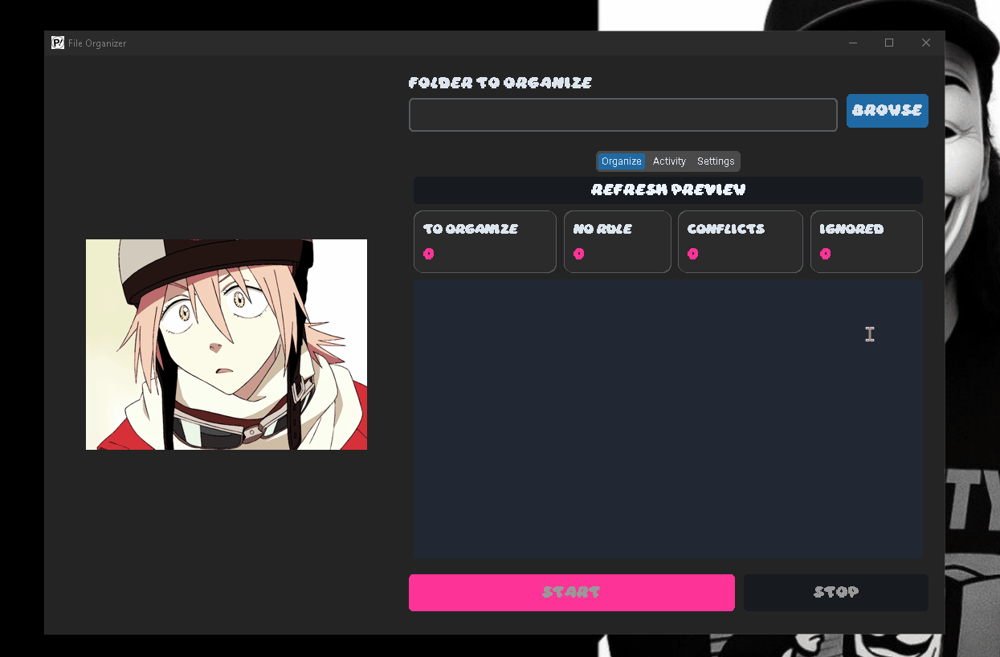

<p align="center">
  
</p>

<h1 align="center">FLCL FILE ORGANIZER</h1>

<p align="center"><strong>Automatic file organization with a preview-first workflow</strong></p>

<p align="center">Classify, monitor, and clean up your folders without losing control of where your files go.</p>

<p align="center">
  
  
  
  
  
</p>

<p align="center">
  
</p>

<p align="center"><em>Inspired by FLCL. Designed for dependable everyday file management.</em></p>

---

## ⚠ Safety and behavior

FLCL File Organizer moves files on your behalf. Always review the preview before starting a new folder and avoid pointing it at directories containing applications or files that must remain in place.

- The preview does not change files on disk.
- Existing destination files are never overwritten.
- Name conflicts receive a unique suffix such as `report (1).pdf`.
- Files are checked for stability before they are moved, reducing races with active downloads and copies.
- Recursive organization is opt-in and asks for confirmation before starting.
- Undo restores the most recent organization run when the original path is still available.

This tool is intended for files and folders you own or are authorized to manage.

## 📖 About

FLCL File Organizer is a Windows desktop utility that turns a folder into a monitored, rule-driven workspace. It can organize files already present in a directory and continue watching for new files in the background.

The application uses a preview-first workflow: before any move occurs, it builds a destination plan and reports the number of files to organize, files without a matching rule, conflicts, and ignored items. This keeps automation visible instead of making it feel like a black box.

The interface uses a dark FLCL-inspired visual identity, an animated image, and a compact tabbed layout. A dark neutral theme is also available for users who want the same contrast and behavior with a quieter visual treatment.

## ✨ Capabilities

### File organization

- Organize existing files during the initial scan.
- Monitor a folder continuously with `watchdog`.
- Classify files by simple or compound extensions such as `.pdf`, `.jpg`, and `.tar.gz`.
- Send unmatched extensions to the `Others` category.
- Wait for files to become stable before moving them.
- Resolve destination collisions with unique names instead of overwriting.

### Preview and control

- Review the complete destination plan before starting.
- Refresh the preview after changing rules or filters.
- See live summary counts for files to organize, missing rules, conflicts, and ignored files.
- Pause and resume monitoring without closing the application.
- Stop the current monitoring session cleanly.
- Undo the most recent organization run using recorded move history.

### Rules and filters

- Create custom categories and map extensions to destination folders.
- Support compound extensions through longest-match detection.
- Ignore hidden files by default.
- Exclude extensions, filename patterns, and folders.
- Ignore files below a configurable minimum size.
- Include subfolders through an explicit recursive mode.
- Edit rules and filters directly from the Settings view.

### Reports and Windows integration

- Generate reports containing organized files, popular categories, errors, space usage, and recent history.
- Show Windows notifications when files are organized.
- Start automatically with Windows.
- Minimize to the system tray.
- Remember the last selected folder.
- Choose between the FLCL dark theme and the dark neutral theme.
- Use the full interface in a smaller, non-maximized window.

## 🖥 Interface

The main window is organized around three focused views:

| View | Purpose |
|---|---|
| **Organize** | Select a folder, refresh the preview, inspect the destination plan, and review summary counts. |
| **Activity** | Follow the current state and inspect the live operation log. |
| **Settings** | Pause monitoring, undo the latest run, edit rules and filters, open reports, and manage preferences. |

The primary `Start` and `Stop` actions remain anchored in the main footer so they stay accessible while the preview or activity view grows.

## 🔄 Organization workflow

```text
[Choose a folder]
        │
        ├─► Load rules and filters
        │
        ├─► Build a non-destructive preview
        │      ├─ Files to organize
        │      ├─ Files without a matching rule
        │      ├─ Name conflicts
        │      └─ Ignored files
        │
        ├─► Review destination plan
        │
        ├─► Start initial scan
        │
        ├─► Monitor new files in real time
        │      ├─ Wait for file stability
        │      ├─ Resolve destination conflicts
        │      └─ Record every successful move
        │
        └─► Stop, pause, report, or undo the latest run
```

## 🚀 Installation

### Ready-to-use Windows build

1. Open the [Releases page](https://github.com/shwdaniel7/FLCL-File-Organizer/releases).
2. Download the latest `FLCL_File_Organizer.zip` package.
3. Extract the archive.
4. Run `FLCL_File_Organizer.exe`.

The packaged version includes Python and the required dependencies.

### Run from source

Requirements:

- Windows 10 or newer
- Python 3.10 or newer

```powershell
git clone https://github.com/shwdaniel7/FLCL-File-Organizer.git
Set-Location FLCL-File-Organizer

python -m venv .venv
.\.venv\Scripts\Activate.ps1
pip install -r requirements.txt
python app.py
```

> PowerShell may require an execution-policy adjustment in some environments. Use the policy appropriate for your machine and organization.

## ⚙ Rules and configuration

Rules are edited from **Settings > Edit rules & filters**. Each rule uses one category followed by a comma-separated list of extensions:

```text
Category: .extension, .another-extension
```

Example:

```text
Images: .png, .jpg, .gif, .webp
Documents: .pdf, .docx, .txt
Archives: .zip, .7z, .tar.gz
Projects: .py, .js, .html, .css
```

The filter editor accepts the following fields:

```text
extensions: .tmp, .bak, .crdownload
patterns: *.part, ~$*
folders: Temp, Cache, Downloads
```

Hidden files can be excluded with the dedicated **Ignore hidden files** option. The minimum-size filter is preserved in the settings model and can be configured in JSON when needed.

### Settings persistence

The application stores user settings and move history in the per-user Windows application data area. This prevents the app from depending on its current working directory and keeps preferences available between launches.

When no user configuration exists yet, the bundled `config.json` is used as the initial configuration. The selected folder, theme, recursive mode, notifications, autostart, and tray preferences are retained.

## 📊 Preview, reports, and undo

The preview summarizes the current plan without moving anything. A planned destination may include the `RENAME` marker when a collision is detected, while `NO RULE` identifies files that will be sent to the fallback category.

The report view is available from **Settings > Open reports** and includes:

- total files organized;
- most frequently used categories;
- recorded errors;
- space occupied by category;
- recent organization history.

**Undo last run** uses the recorded source and destination paths from the latest run. If the destination file no longer exists, or the original path has since been occupied by another file, that item is skipped and the reason is logged instead of overwriting anything.

## 📂 Project structure

```text
FLCL-File-Organizer/
├── app.py              Application entrypoint
├── config.json         Bundled default rules and preferences
├── requirements.txt    Runtime dependencies
├── Daydream.ttf        Interface font
├── demo.gif            Interface demonstration asset
├── icon.ico            Windows application icon
├── icon.png            Tray and packaged icon asset
├── src/
│   ├── gui.py          CustomTkinter interface and application lifecycle
│   └── organizer.py    Rules, preview, movement, history, monitoring, and reports
└── tests/
    └── test_reports.py Report regression coverage
```

The code keeps the UI and organizer engine separate. Background monitoring and undo work run away from the UI thread, while log messages are queued back to the interface for safe display.

## 🧪 Development

Run the regression tests and compile check from the repository root:

```powershell
python -m unittest discover -s tests -v
python -m compileall src
```

The current test suite covers report generation and history-derived summaries. Changes to movement, conflict handling, preview classification, or monitoring should add focused regression coverage before release.

## 📦 Build a Windows executable

Install PyInstaller inside the active virtual environment:

```powershell
pip install pyinstaller
```

Then build the application with its runtime assets:

```powershell
pyinstaller --name "FLCL_File_Organizer" --onefile --windowed --icon="icon.ico" --add-data "haruko.gif;." --add-data "Daydream.ttf;." --add-data "config.json;." --add-data "icon.png;." app.py
```

The executable is written to `dist/`. The `--add-data` entries include the animation, font, default configuration, and tray icon required by the packaged application.

## 🧩 Technology stack

- **Python 3** - application runtime and file-management logic.
- **CustomTkinter** - dark desktop interface and responsive layout.
- **Watchdog** - filesystem event monitoring.
- **Pillow** - animated GIF and image loading.
- **Pystray** - system tray integration.
- **Winotify** - Windows notifications.
- **JSON** - rules, preferences, move history, and report data.
- **PyInstaller** - standalone Windows packaging.

## 📄 License

This project is licensed under the MIT License.

<p align="center"><strong>FLCL File Organizer</strong><br />A little order for the files that keep finding new ways to multiply.</p>
